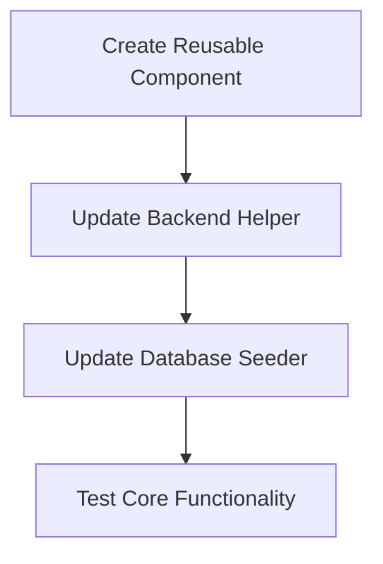
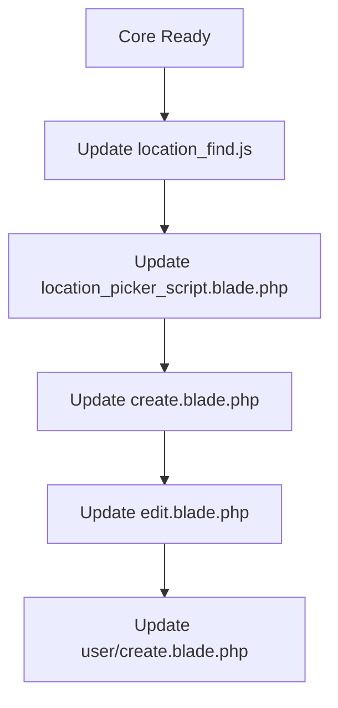

# OpenStreetMap + Leaflet.js Migration Architecture

## Executive Summary

This document outlines the architecture for replacing Google Maps API with OpenStreetMap (OSM) and Leaflet.js in the AbcHRM Laravel application. The migration eliminates API costs, removes external dependencies on Google services, and provides equivalent functionality using open-source alternatives.

---

## Table of Contents

1. [Library Selection](#1-library-selection)
2. [Code Architecture](#2-code-architecture)
3. [Feature Mapping](#3-feature-mapping)
4. [Backend Changes](#4-backend-changes)
5. [Implementation Order](#5-implementation-order)
6. [Testing Strategy](#6-testing-strategy)

---

## 1. Library Selection

### 1.1 Core Libraries

| Library | Version | Purpose | CDN/Installation |
|---------|---------|---------|------------------|
| **Leaflet.js** | 1.9.4 | Core map rendering library | CDN or npm |
| **Leaflet CSS** | 1.9.4 | Map styling | CDN |
| **Leaflet-Geosearch** | 3.11.1 | Address autocomplete/search | CDN or npm |
| **Leaflet-MarkerCluster** | 1.5.3 | Optional: Marker clustering | CDN |

### 1.2 CDN Links (Recommended for Quick Implementation)

```html
<!-- Leaflet CSS -->
<link rel="stylesheet" href="https://unpkg.com/leaflet@1.9.4/dist/leaflet.css"
      integrity="sha256-p4NxAoJBhIIN+hmNHrzRCf9tD/miZyoHS5obTRR9BMY="
      crossorigin="" />

<!-- Leaflet JS -->
<script src="https://unpkg.com/leaflet@1.9.4/dist/leaflet.js"
        integrity="sha256-20nQCchB9co0qIjJZRGuk2/Z9VM+kNiyxNV1lvTlZBo="
        crossorigin=""></script>

<!-- Leaflet-Geosearch (for autocomplete) -->
<link rel="stylesheet" href="https://unpkg.com/leaflet-geosearch@3.11.1/dist/geosearch.css" />
<script src="https://unpkg.com/leaflet-geosearch@3.11.1/dist/geosearch.umd.js"></script>
```

### 1.3 Local Installation (Alternative)

If preferring local assets for offline capability or version control:

```bash
# Using npm
npm install leaflet leaflet-geosearch

# Copy to public directory
cp -r node_modules/leaflet/dist/* public/assets/leaflet/
cp -r node_modules/leaflet-geosearch/dist/* public/assets/leaflet-geosearch/
```

### 1.4 Tile Layer Providers

#### Primary: OpenStreetMap (Free, No API Key)

```javascript
L.tileLayer('https://{s}.tile.openstreetmap.org/{z}/{x}/{y}.png', {
  attribution: '&copy; <a href="https://www.openstreetmap.org/copyright">OpenStreetMap</a> contributors',
  maxZoom: 19
});
```

#### Alternative: CartoDB (Cleaner Visual Style)

```javascript
// CartoDB Positron (Light theme - recommended for business apps)
L.tileLayer('https://{s}.basemaps.cartocdn.com/light_all/{z}/{x}/{y}{r}.png', {
  attribution: '&copy; <a href="https://www.openstreetmap.org/copyright">OpenStreetMap</a> contributors &copy; <a href="https://carto.com/attributions">CARTO</a>',
  maxZoom: 19
});

// CartoDB Voyager (More detailed)
L.tileLayer('https://{s}.basemaps.cartocdn.com/rastertiles/voyager/{z}/{x}/{y}{r}.png', {
  attribution: '&copy; <a href="https://www.openstreetmap.org/copyright">OpenStreetMap</a> contributors &copy; <a href="https://carto.com/attributions">CARTO</a>',
  maxZoom: 19
});
```

#### Fallback Tile Providers

| Provider | Usage Limit | API Key Required | Best For |
|----------|-------------|------------------|----------|
| OpenStreetMap | Fair use policy | No | General use |
| CartoDB | 75,000 mapviews/month | No | Clean business look |
| Stadia Maps | 150,000 loads/month | Yes (free tier) | High quality |
| MapTiler | 100,000 loads/month | Yes (free tier) | Custom styling |

---

## 2. Code Architecture

### 2.1 Directory Structure

```
public/
├── assets/
│   └── leaflet/
│       ├── images/           # Marker icons
│       ├── leaflet.css
│       └── leaflet.js

resources/
├── assets/
│   └── js/
│       └── components/
│           └── leaflet-map.js    # Reusable map component
└── views/
    └── components/
        └── leaflet-map.blade.php # Blade component wrapper
```

### 2.2 Reusable Leaflet Map Component

Create a centralized map helper that standardizes initialization across all instances:

```javascript
// resources/assets/js/components/leaflet-map.js

/**
 * HRMLeafletMap - Reusable map component for AbcHRM
 * 
 * Usage:
 *   const map = new HRMLeafletMap({
 *     container: 'map',
 *     latitude: 23.7925128,
 *     longitude: 90.4077114,
 *     radius: 100,
 *     draggable: true,
 *     onLocationChange: (lat, lng, address) => { ... }
 *   });
 */

class HRMLeafletMap {
  constructor(options) {
    this.options = {
      container: options.container || 'map',
      latitude: parseFloat(options.latitude) || 23.7925128,
      longitude: parseFloat(options.longitude) || 90.4077114,
      zoom: options.zoom || 16,
      radius: parseFloat(options.radius) || 0,
      draggable: options.draggable !== false,
      showSearch: options.showSearch !== false,
      searchInputId: options.searchInputId || 'pac-input',
      tileLayer: options.tileLayer || 'osm', // 'osm' or 'cartodb'
      onLocationChange: options.onLocationChange || null,
      onMarkerDrop: options.onMarkerDrop || null,
    };

    this.map = null;
    this.marker = null;
    this.circle = null;
    this.searchControl = null;

    this.init();
  }

  init() {
    this.initMap();
    this.initTileLayer();
    this.initMarker();
    this.initCircle();
    if (this.options.showSearch) {
      this.initSearch();
    }
    this.initEvents();
  }

  initMap() {
    this.map = L.map(this.options.container, {
      center: [this.options.latitude, this.options.longitude],
      zoom: this.options.radius > 200 ? 12 : this.options.zoom,
      zoomControl: true,
      scrollWheelZoom: true,
    });

    // Add scale control
    L.control.scale({ imperial: false }).addTo(this.map);
  }

  initTileLayer() {
    let tileUrl, attribution;

    if (this.options.tileLayer === 'cartodb') {
      tileUrl = 'https://{s}.basemaps.cartocdn.com/light_all/{z}/{x}/{y}{r}.png';
      attribution = '&copy; <a href="https://www.openstreetmap.org/copyright">OpenStreetMap</a> contributors &copy; <a href="https://carto.com/attributions">CARTO</a>';
    } else {
      tileUrl = 'https://{s}.tile.openstreetmap.org/{z}/{x}/{y}.png';
      attribution = '&copy; <a href="https://www.openstreetmap.org/copyright">OpenStreetMap</a> contributors';
    }

    L.tileLayer(tileUrl, {
      attribution: attribution,
      maxZoom: 19,
    }).addTo(this.map);
  }

  initMarker() {
    // Custom marker icon (optional - uses default if not specified)
    const customIcon = L.icon({
      iconUrl: '/assets/leaflet/images/marker-icon.png',
      iconRetinaUrl: '/assets/leaflet/images/marker-icon-2x.png',
      shadowUrl: '/assets/leaflet/images/marker-shadow.png',
      iconSize: [25, 41],
      iconAnchor: [12, 41],
      popupAnchor: [1, -34],
      shadowSize: [41, 41]
    });

    this.marker = L.marker([this.options.latitude, this.options.longitude], {
      draggable: this.options.draggable,
      icon: customIcon,
    }).addTo(this.map);

    // Drop animation effect
    this.animateMarkerDrop();
  }

  animateMarkerDrop() {
    // Leaflet doesn't have built-in drop animation like Google Maps
    // We simulate it with a bounce effect
    const originalLat = this.marker.getLatLng().lat;
    this.marker.setLatLng([originalLat + 0.01, this.marker.getLatLng().lng]);
    
    setTimeout(() => {
      this.marker.setLatLng([this.options.latitude, this.options.longitude]);
    }, 100);
  }

  initCircle() {
    if (this.options.radius > 0) {
      this.circle = L.circle([this.options.latitude, this.options.longitude], {
        radius: this.options.radius,
        fillColor: '#36AA4A',
        color: '#36AA4A',
        weight: 2,
        opacity: 0.5,
        fillOpacity: 0.5
      }).addTo(this.map);
    }
  }

  updateCircle() {
    if (this.circle) {
      this.map.removeLayer(this.circle);
    }
    if (this.options.radius > 0) {
      this.circle = L.circle(this.marker.getLatLng(), {
        radius: this.options.radius,
        fillColor: '#36AA4A',
        color: '#36AA4A',
        weight: 2,
        opacity: 0.5,
        fillOpacity: 0.5
      }).addTo(this.map);
    }
  }

  setRadius(radius) {
    this.options.radius = parseFloat(radius);
    this.updateCircle();
  }

  initSearch() {
    const searchInput = document.getElementById(this.options.searchInputId);
    
    // Use Leaflet-Geosearch with OpenStreetMap provider
    const provider = new GeoSearch.OpenStreetMapProvider({
      params: {
        addressdetails: 1,
      },
    });

    // Create custom search control that uses existing input
    this.searchControl = new GeoSearch.GeoSearchControl({
      provider: provider,
      style: 'bar',
      showMarker: false,
      showPopup: false,
      autoClose: true,
      retainZoomLevel: false,
      searchLabel: 'Enter address',
    });

    this.map.addControl(this.searchControl);

    // Listen for search results
    this.map.on('geosearch/showlocation', (result) => {
      const location = result.location;
      this.marker.setLatLng([location.y, location.x]);
      this.updateCircle();
      
      if (searchInput) {
        searchInput.value = location.label;
      }

      if (this.options.onLocationChange) {
        this.options.onLocationChange(location.y, location.x, location.label);
      }
    });
  }

  initEvents() {
    // Marker drag event
    this.marker.on('dragend', async (e) => {
      const position = this.marker.getLatLng();
      this.updateCircle();

      // Reverse geocode to get address
      const address = await this.reverseGeocode(position.lat, position.lng);
      
      const searchInput = document.getElementById(this.options.searchInputId);
      if (searchInput && address) {
        searchInput.value = address;
      }

      if (this.options.onMarkerDrop) {
        this.options.onMarkerDrop(position.lat, position.lng, address);
      }

      if (this.options.onLocationChange) {
        this.options.onLocationChange(position.lat, position.lng, address);
      }
    });
  }

  async reverseGeocode(lat, lng) {
    try {
      const response = await fetch(
        `https://nominatim.openstreetmap.org/reverse?format=json&lat=${lat}&lon=${lng}&zoom=18&addressdetails=1`
      );
      const data = await response.json();
      return data.display_name || '';
    } catch (error) {
      console.error('Reverse geocoding failed:', error);
      return '';
    }
  }

  // Public methods
  setPosition(lat, lng) {
    this.marker.setLatLng([lat, lng]);
    this.map.setView([lat, lng], this.options.zoom);
    this.updateCircle();
  }

  getPosition() {
    return this.marker.getLatLng();
  }

  invalidateSize() {
    this.map.invalidateSize();
  }

  destroy() {
    if (this.map) {
      this.map.remove();
    }
  }
}

// Export for module usage
if (typeof module !== 'undefined' && module.exports) {
  module.exports = HRMLeafletMap;
}
```

### 2.3 Blade Component Wrapper

```blade
{{-- resources/views/components/leaflet-map.blade.php --}}

@props([
    'containerId' => 'map',
    'latitude' => '23.7925128',
    'longitude' => '90.4077114',
    'radius' => '0',
    'searchInputId' => 'pac-input',
    'height' => '400px',
])

<div id="{{ $containerId }}" style="height: {{ $height }}; width: 100%;"></div>

@once
@push('styles')
<link rel="stylesheet" href="https://unpkg.com/leaflet@1.9.4/dist/leaflet.css"
      integrity="sha256-p4NxAoJBhIIN+hmNHrzRCf9tD/miZyoHS5obTRR9BMY="
      crossorigin="" />
<link rel="stylesheet" href="https://unpkg.com/leaflet-geosearch@3.11.1/dist/geosearch.css" />
@endpush
@endonce

@once
@push('scripts')
<script src="https://unpkg.com/leaflet@1.9.4/dist/leaflet.js"
        integrity="sha256-20nQCchB9co0qIjJZRGuk2/Z9VM+kNiyxNV1lvTlZBo="
        crossorigin=""></script>
<script src="https://unpkg.com/leaflet-geosearch@3.11.1/dist/geosearch.umd.js"></script>
<script src="{{ asset('js/components/leaflet-map.js') }}"></script>
@endpush
@endonce
```

### 2.4 Standard Initialization Pattern

```javascript
// Standard pattern for all map instances
$(document).ready(function() {
    let latitude = $('#latitude').val() ?? 23.7925128;
    let longitude = $('#longitude').val() ?? 90.4077114;
    let distance = $('#distance').val() ?? 0;

    // Initialize map using the reusable component
    const hrmMap = new HRMLeafletMap({
        container: 'map',
        latitude: latitude,
        longitude: longitude,
        radius: distance,
        searchInputId: 'pac-input',
        onLocationChange: function(lat, lng, address) {
            // Update hidden fields
            $('#latitude').val(lat);
            $('#longitude').val(lng);
            latitude = lat;
            longitude = lng;
        }
    });

    // Update radius when distance input changes
    $('#distance').on('change', function() {
        distance = $(this).val();
        hrmMap.setRadius(distance);
    });

    // Handle modal re-render (for Bootstrap modals)
    $('#locationModal').on('shown.bs.modal', function() {
        hrmMap.invalidateSize();
    });
});
```

---

## 3. Feature Mapping

### 3.1 Complete Google Maps → Leaflet Migration Table

| Google Maps Feature | Google Maps Code | Leaflet Equivalent | Notes |
|---------------------|------------------|-------------------|-------|
| **Map Initialization** | `new google.maps.Map(element, options)` | `L.map(element, options)` | Similar configuration |
| **Tile Layer** | Built-in (mapTypeId) | `L.tileLayer(url, options)` | Must explicitly add tiles |
| **Center** | `center: {lat, lng}` | `center: [lat, lng]` | Array format in Leaflet |
| **Zoom** | `zoom: 16` | `zoom: 16` | Same |
| **Zoom Control** | `zoomControl: true` | `zoomControl: true` | Same |
| **Scale Control** | `scaleControl: true` | `L.control.scale()` | Separate control |
| **Map Type Control** | `mapTypeControl: true` | Not available | Use tile layer switcher plugin |
| **Street View** | `streetViewControl: true` | Not available | No equivalent in OSM |
| **Rotate Control** | `rotateControl: true` | Not available | Rarely used |
| **Fullscreen** | `fullscreenControl: true` | `L.control.fullscreen()` | Requires plugin |
| **Marker** | `new google.maps.Marker()` | `L.marker()` | Similar API |
| **Draggable Marker** | `draggable: true` | `draggable: true` | Same |
| **Drop Animation** | `animation: google.maps.Animation.DROP` | Custom implementation | Simulate with CSS/JS |
| **Circle** | `new google.maps.Circle()` | `L.circle()` | Similar API |
| **Circle BindTo** | `circle.bindTo('center', marker, 'position')` | Manual update on drag | Different approach |
| **Places Autocomplete** | `new google.maps.places.Autocomplete()` | `GeoSearch.GeoSearchControl` | Different library |
| **Geocoder** | `new google.maps.Geocoder()` | Nominatim API / Photon | Free alternatives |
| **Event Listener** | `google.maps.event.addListener(obj, event, fn)` | `obj.on(event, fn)` | Simpler in Leaflet |
| **Get Position** | `marker.getPosition()` | `marker.getLatLng()` | Similar |
| **Set Position** | `marker.setPosition(latLng)` | `marker.setLatLng([lat, lng])` | Array format |
| **Fit Bounds** | `map.fitBounds(bounds)` | `map.fitBounds(bounds)` | Same |
| **Pan To** | `map.panTo(latLng)` | `map.panTo([lat, lng])` | Array format |

### 3.2 Code Snippets for Each Feature

#### 3.2.1 Map Initialization with Controls

**Google Maps:**
```javascript
map = new google.maps.Map(document.getElementById('map'), {
  center: { lat: parseFloat(latitude), lng: parseFloat(longitude) },
  zoom: 16,
  mapTypeId: 'roadmap'
});

map.setOptions({
  scrollwheel: true,
  zoomControl: true,
  mapTypeControl: true,
  scaleControl: true,
  streetViewControl: true,
  rotateControl: true,
  fullscreenControl: true,
});
```

**Leaflet:**
```javascript
// Initialize map
const map = L.map('map', {
  center: [parseFloat(latitude), parseFloat(longitude)],
  zoom: 16,
  zoomControl: true,
  scrollWheelZoom: true,
});

// Add tile layer (required in Leaflet)
L.tileLayer('https://{s}.tile.openstreetmap.org/{z}/{x}/{y}.png', {
  attribution: '&copy; OpenStreetMap contributors',
  maxZoom: 19,
}).addTo(map);

// Add scale control
L.control.scale({ imperial: false }).addTo(map);

// Optional: Add fullscreen (requires leaflet.fullscreen plugin)
// L.control.fullscreen({ position: 'topleft' }).addTo(map);
```

#### 3.2.2 Draggable Marker with Drop Animation

**Google Maps:**
```javascript
marker = new google.maps.Marker({
  map: map,
  position: { lat: latitude, lng: longitude },
  draggable: true,
  clickable: true,
  animation: google.maps.Animation.DROP
});
```

**Leaflet:**
```javascript
// Custom marker icon (optional)
const customIcon = L.icon({
  iconUrl: '/images/marker-icon.png',
  iconSize: [25, 41],
  iconAnchor: [12, 41],
  popupAnchor: [1, -34],
});

// Create marker
const marker = L.marker([latitude, longitude], {
  draggable: true,
  icon: customIcon, // or omit for default
}).addTo(map);

// Simulate drop animation (Leaflet doesn't have built-in)
function animateDrop() {
  const startLatLng = [latitude + 0.02, longitude];
  marker.setLatLng(startLatLng);
  
  let currentLat = startLatLng[0];
  const dropInterval = setInterval(() => {
    currentLat -= 0.001;
    if (currentLat <= latitude) {
      clearInterval(dropInterval);
      marker.setLatLng([latitude, longitude]);
    } else {
      marker.setLatLng([currentLat, longitude]);
    }
  }, 30);
}
animateDrop();
```

#### 3.2.3 Circle Overlay for Attendance Radius

**Google Maps:**
```javascript
circle = new google.maps.Circle({
  map: map,
  radius: parseFloat(distance),
  fillColor: '#36AA4A',
  strokeColor: '#36AA4A',
  strokeOpacity: 0.5,
  strokeWeight: 2,
  fillOpacity: 0.5
});

circle.bindTo('center', marker, 'position');
```

**Leaflet:**
```javascript
// Create circle
let circle = L.circle([latitude, longitude], {
  radius: parseFloat(distance),
  fillColor: '#36AA4A',
  color: '#36AA4A',
  weight: 2,
  opacity: 0.5,
  fillOpacity: 0.5
}).addTo(map);

// Update circle position when marker is dragged (manual binding)
marker.on('drag', function(e) {
  circle.setLatLng(e.target.getLatLng());
});

// Or update on dragend
marker.on('dragend', function(e) {
  circle.setLatLng(e.target.getLatLng());
});
```

#### 3.2.4 Places Autocomplete for Location Search

**Google Maps:**
```javascript
var input = document.getElementById('pac-input');
var autocomplete = new google.maps.places.Autocomplete(input);
autocomplete.bindTo('bounds', map);

autocomplete.addListener('place_changed', function() {
  var place = autocomplete.getPlace();
  if (place.geometry.viewport) {
    map.fitBounds(place.geometry.viewport);
  } else {
    map.setCenter(place.geometry.location);
  }
  marker.setPosition(place.geometry.location);
  
  currentLatitude = place.geometry.location.lat();
  currentLongitude = place.geometry.location.lng();
});
```

**Leaflet (using leaflet-geosearch):**
```javascript
// Initialize search provider
const provider = new GeoSearch.OpenStreetMapProvider();

// Add search control to map
const searchControl = new GeoSearch.GeoSearchControl({
  provider: provider,
  style: 'bar',
  showMarker: false,
  showPopup: false,
  autoClose: true,
  searchLabel: 'Enter address',
});
map.addControl(searchControl);

// Listen for location selection
map.on('geosearch/showlocation', function(result) {
  const location = result.location;
  
  // Update marker position
  marker.setLatLng([location.y, location.x]);
  
  // Update circle if exists
  if (circle) {
    circle.setLatLng([location.y, location.x]);
  }
  
  // Update form fields
  const input = document.getElementById('pac-input');
  if (input) {
    input.value = location.label;
  }
  
  currentLatitude = location.y;
  currentLongitude = location.x;
});
```

**Alternative: Using existing input field with autocomplete:**
```javascript
// Custom implementation using existing input
const input = document.getElementById('pac-input');
const provider = new GeoSearch.OpenStreetMapProvider();

let debounceTimer;
input.addEventListener('input', async function() {
  clearTimeout(debounceTimer);
  debounceTimer = setTimeout(async () => {
    const results = await provider.search({ query: input.value });
    // Display results in dropdown
    showResultsDropdown(results, input);
  }, 300);
});

function showResultsDropdown(results, input) {
  // Remove existing dropdown
  const existing = document.querySelector('.geosearch-dropdown');
  if (existing) existing.remove();
  
  if (results.length === 0) return;
  
  // Create dropdown
  const dropdown = document.createElement('ul');
  dropdown.className = 'geosearch-dropdown';
  dropdown.style.cssText = 'position: absolute; z-index: 1000; background: white; list-style: none; padding: 0; margin: 0; border: 1px solid #ccc; max-height: 200px; overflow-y: auto;';
  
  results.forEach(result => {
    const li = document.createElement('li');
    li.textContent = result.label;
    li.style.cssText = 'padding: 8px 12px; cursor: pointer;';
    li.addEventListener('click', () => selectResult(result));
    dropdown.appendChild(li);
  });
  
  input.parentNode.style.position = 'relative';
  input.parentNode.appendChild(dropdown);
}

function selectResult(result) {
  input.value = result.label;
  marker.setLatLng([result.y, result.x]);
  map.setView([result.y, result.x], 16);
  if (circle) circle.setLatLng([result.y, result.x]);
  
  // Remove dropdown
  document.querySelector('.geosearch-dropdown')?.remove();
}
```

#### 3.2.5 Reverse Geocoding (Coordinates → Address)

**Google Maps:**
```javascript
var geocoder = new google.maps.Geocoder;

geocoder.geocode({
  'location': { lat: latitude, lng: longitude }
}, function(results, status) {
  if (status === 'OK') {
    if (results[0]) {
      input.value = results[0].formatted_address;
    }
  }
});
```

**Leaflet (using Nominatim API):**
```javascript
async function reverseGeocode(lat, lng) {
  try {
    const response = await fetch(
      `https://nominatim.openstreetmap.org/reverse?format=json&lat=${lat}&lon=${lng}&zoom=18&addressdetails=1`
    );
    
    if (!response.ok) throw new Error('Geocoding failed');
    
    const data = await response.json();
    return data.display_name || '';
  } catch (error) {
    console.error('Reverse geocoding error:', error);
    return '';
  }
}

// Usage in dragend event
marker.on('dragend', async function(e) {
  const position = e.target.getLatLng();
  const address = await reverseGeocode(position.lat, position.lng);
  
  const input = document.getElementById('pac-input');
  if (input && address) {
    input.value = address;
  }
  
  // Update hidden fields
  document.getElementById('latitude').value = position.lat;
  document.getElementById('longitude').value = position.lng;
});
```

---

## 4. Backend Changes

### 4.1 Nominatim API Integration

The [`getUserAddress()`](app/Helpers/helpers.php:350) function needs to be updated to use Nominatim instead of Google Maps Geocoding API.

#### Current Implementation (Google Maps):
```php
// app/Helpers/helpers.php (lines 350-381)
if (! function_exists('getUserAddress')) {
    function getUserAddress($latitude = null, $longitude = null)
    {
        $apiKey = @globalSetting('google_map_key', 'integration');

        if (! $apiKey || ! $latitude || ! $longitude) {
            $location = Location::get(getUserIp());
            return $location ? $location->cityName : null;
        }

        try {
            $response = Http::get('https://maps.googleapis.com/maps/api/geocode/json', [
                'latlng' => "{$latitude},{$longitude}",
                'key' => $apiKey,
            ])->json();

            if (! empty($response['results'])) {
                $largestFormattedAddress = collect($response['results'])
                    ->pluck('formatted_address')
                    ->filter()
                    ->sortByDesc(fn ($address) => strlen($address))
                    ->first();

                return $largestFormattedAddress ?? '';
            }
        } catch (Exception $exception) {
            info('Geocode API error: '.$exception->getMessage());
        }
    }
}
```

#### New Implementation (Nominatim):
```php
// app/Helpers/helpers.php

if (! function_exists('getUserAddress')) {
    /**
     * Get user address from coordinates using Nominatim (OpenStreetMap)
     * 
     * @param float|null $latitude
     * @param float|null $longitude
     * @return string|null
     */
    function getUserAddress($latitude = null, $longitude = null)
    {
        if (! $latitude || ! $longitude) {
            $location = Location::get(getUserIp());
            return $location ? $location->cityName : null;
        }

        try {
            // Use Nominatim API (free, no API key required)
            $response = Http::withHeaders([
                'User-Agent' => 'AbcHRM/1.0 (contact@yourcompany.com)', // Required by Nominatim
                'Accept-Language' => app()->getLocale(), // Optional: get results in preferred language
            ])->get('https://nominatim.openstreetmap.org/reverse', [
                'lat' => $latitude,
                'lon' => $longitude,
                'format' => 'json',
                'zoom' => 18,
                'addressdetails' => 1,
            ]);

            if ($response->successful()) {
                $data = $response->json();
                
                if (isset($data['display_name'])) {
                    return $data['display_name'];
                }
            }

            return null;
        } catch (Exception $exception) {
            info('Nominatim Geocode API error: '.$exception->getMessage());
            return null;
        }
    }
}
```

### 4.2 Alternative: Photon API (Komoot)

For higher rate limits and potentially better performance:

```php
if (! function_exists('getUserAddress')) {
    function getUserAddress($latitude = null, $longitude = null)
    {
        if (! $latitude || ! $longitude) {
            $location = Location::get(getUserIp());
            return $location ? $location->cityName : null;
        }

        try {
            // Photon API (Komoot) - higher rate limits
            $response = Http::get('https://photon.komoot.io/reverse', [
                'lat' => $latitude,
                'lon' => $longitude,
            ]);

            if ($response->successful()) {
                $data = $response->json();
                
                if (!empty($data['features'][0]['properties'])) {
                    $props = $data['features'][0]['properties'];
                    // Build address from components
                    $parts = array_filter([
                        $props['name'] ?? null,
                        $props['street'] ?? null,
                        $props['housenumber'] ?? null,
                        $props['postcode'] ?? null,
                        $props['city'] ?? null,
                        $props['state'] ?? null,
                        $props['country'] ?? null,
                    ]);
                    return implode(', ', $parts);
                }
            }

            return null;
        } catch (Exception $exception) {
            info('Photon Geocode API error: '.$exception->getMessage());
            return null;
        }
    }
}
```

### 4.3 Rate Limiting and Caching

Nominatim has a rate limit of 1 request per second. Implement caching to avoid hitting limits:

```php
if (! function_exists('getUserAddress')) {
    function getUserAddress($latitude = null, $longitude = null)
    {
        if (! $latitude || ! $longitude) {
            $location = Location::get(getUserIp());
            return $location ? $location->cityName : null;
        }

        // Round coordinates to reduce cache variations (approx 100m precision)
        $cacheKey = 'geocode_' . round($latitude, 4) . '_' . round($longitude, 4);

        // Cache for 30 days (coordinates rarely change meaning)
        return Cache::remember($cacheKey, now()->addDays(30), function () use ($latitude, $longitude) {
            try {
                $response = Http::withHeaders([
                    'User-Agent' => 'AbcHRM/1.0',
                ])
                ->timeout(5)
                ->get('https://nominatim.openstreetmap.org/reverse', [
                    'lat' => $latitude,
                    'lon' => $longitude,
                    'format' => 'json',
                    'zoom' => 18,
                ]);

                if ($response->successful()) {
                    $data = $response->json();
                    return $data['display_name'] ?? null;
                }

                return null;
            } catch (Exception $exception) {
                info('Geocode API error: '.$exception->getMessage());
                return null;
            }
        });
    }
}
```

### 4.4 Database Seeder Update

Update [`GoogleMapIntegrationSeeder.php`](database/seeders/Setting/Integration/GoogleMapIntegrationSeeder.php) to reflect the new OSM integration:

```php
<?php

namespace Database\Seeders\Setting\Integration;

use App\Models\Setting\Integration;
use App\Models\Setting\IntegrationSetting;
use Illuminate\Database\Seeder;

class OpenStreetMapIntegrationSeeder extends Seeder
{
    public function run(): void
    {
        $company_id = \App\Models\Company::first()?->id ?? 1;

        $integrations = [];
        $fields = [];

        // OpenStreetMap Integration
        $integrations[] = [
            'name' => 'OpenStreetMap',
            'slug' => 'openstreet_map',
            'has_permission' => null,
            'image' => json_encode([
                'disk' => config('filesystems.default'),
                'file' => 'seeder/integration/openstreetmap.png',
            ]),
            'short_description' => 'Free mapping service using OpenStreetMap data. No API key required.',
            'integration_steps' => json_encode([
                'Step 1' => 'OpenStreetMap is enabled by default.',
                'Step 2' => 'No configuration needed - the service is free and ready to use.',
                'Step 3' => 'Optional: Configure tile provider in settings for different map styles.',
            ]),
            'status' => 'active',
            'company_id' => $company_id,
        ];

        // No API key needed for OSM, but we can store optional settings
        $fields[] = [
            [
                'integration_slug' => 'openstreet_map',
                'key' => 'osm_tile_provider',
                'value' => 'osm', // 'osm', 'cartodb', 'custom'
                'status' => 'active',
                'input_info' => json_encode([
                    'type' => 'select',
                    'label' => 'Tile Provider',
                    'placeholder' => 'Select map tile provider',
                    'column' => 'col-md-12',
                    'options' => [
                        ['value' => 'osm', 'label' => 'OpenStreetMap (Default)'],
                        ['value' => 'cartodb', 'label' => 'CartoDB (Cleaner style)'],
                    ],
                ]),
            ],
            [
                'integration_slug' => 'openstreet_map',
                'key' => 'osm_geocoding_provider',
                'value' => 'nominatim', // 'nominatim', 'photon'
                'status' => 'active',
                'input_info' => json_encode([
                    'type' => 'select',
                    'label' => 'Geocoding Provider',
                    'placeholder' => 'Select geocoding service',
                    'column' => 'col-md-12',
                    'options' => [
                        ['value' => 'nominatim', 'label' => 'Nominatim (OSM default)'],
                        ['value' => 'photon', 'label' => 'Photon (Komoot)'],
                    ],
                ]),
            ],
        ];

        Integration::insert($integrations);
        IntegrationSetting::insert(array_merge(...$fields));
    }
}
```

### 4.5 Migration for Existing Settings

Create a migration to update existing Google Map settings to OSM:

```php
<?php

use Illuminate\Database\Migrations\Migration;
use Illuminate\Support\Facades\DB;

return new class extends Migration
{
    public function up(): void
    {
        // Update existing Google Map integration to OSM
        DB::table('integrations')
            ->where('slug', 'google_map')
            ->update([
                'name' => 'OpenStreetMap',
                'slug' => 'openstreet_map',
                'short_description' => 'Free mapping service using OpenStreetMap data. No API key required.',
                'integration_steps' => json_encode([
                    'Step 1' => 'OpenStreetMap is enabled by default.',
                    'Step 2' => 'No configuration needed - the service is free and ready to use.',
                ]),
            ]);

        // Remove old Google Map API key setting
        DB::table('integration_settings')
            ->where('integration_slug', 'google_map')
            ->where('key', 'google_map_key')
            ->delete();

        // Update integration_slug in settings
        DB::table('integration_settings')
            ->where('integration_slug', 'google_map')
            ->update(['integration_slug' => 'openstreet_map']);
    }

    public function down(): void
    {
        // Revert changes if needed
        DB::table('integrations')
            ->where('slug', 'openstreet_map')
            ->update([
                'name' => 'Google Map',
                'slug' => 'google_map',
                'short_description' => 'Integrate Google Maps to enable location features.',
            ]);
    }
};
```

---

## 5. Implementation Order

### Phase 1: Foundation (Files to modify first)



| Order | File | Changes | Priority |
|-------|------|---------|----------|
| 1 | `resources/assets/js/components/leaflet-map.js` | Create new reusable map component | High |
| 2 | `app/Helpers/helpers.php` | Update `getUserAddress()` to use Nominatim | High |
| 3 | `database/seeders/Setting/Integration/GoogleMapIntegrationSeeder.php` | Convert to OSM seeder | Medium |
| 4 | Create migration for settings update | Database migration | Medium |

### Phase 2: Frontend Implementation



| Order | File | Changes | Priority |
|-------|------|---------|----------|
| 5 | `Modules/AreaBasedAttendance/resources/assets/js/location_find.js` | Replace Google Maps with Leaflet | High |
| 6 | `Modules/AreaBasedAttendance/resources/views/scripts/location_picker_script.blade.php` | Replace inline Google Maps code | High |
| 7 | `Modules/AreaBasedAttendance/resources/views/location/create.blade.php` | Update script includes | High |
| 8 | `Modules/AreaBasedAttendance/resources/views/location/edit.blade.php` | Update script includes | High |
| 9 | `resources/views/user/create.blade.php` | Check and update if needed | Medium |

### Phase 3: Cleanup and Testing

| Order | Task | Description |
|-------|------|-------------|
| 10 | Remove Google Maps references | Search and remove any remaining Google Maps API calls |
| 11 | Update documentation | Update any user/admin documentation |
| 12 | Integration testing | Test all map functionality end-to-end |
| 13 | Performance testing | Verify geocoding response times |

---

## 6. Testing Strategy

### 6.1 Unit Tests

```php
// tests/Unit/Helpers/GeocodingTest.php

<?php

namespace Tests\Unit\Helpers;

use Tests\TestCase;
use Illuminate\Support\Facades\Http;
use Illuminate\Support\Facades\Cache;

class GeocodingTest extends TestCase
{
    public function test_getUserAddress_returns_address_for_valid_coordinates()
    {
        // Mock Nominatim response
        Http::fake([
            'nominatim.openstreetmap.org/*' => Http::response([
                'display_name' => '123 Main St, New York, NY, USA',
            ], 200),
        ]);

        $address = getUserAddress(40.7128, -74.0060);

        $this->assertEquals('123 Main St, New York, NY, USA', $address);
    }

    public function test_getUserAddress_returns_null_for_invalid_coordinates()
    {
        Http::fake([
            'nominatim.openstreetmap.org/*' => Http::response([], 404),
        ]);

        $address = getUserAddress(0, 0);

        $this->assertNull($address);
    }

    public function test_getUserAddress_caches_results()
    {
        Http::fake([
            'nominatim.openstreetmap.org/*' => Http::response([
                'display_name' => 'Cached Address',
            ], 200),
        ]);

        // First call
        getUserAddress(40.7128, -74.0060);
        
        // Second call should use cache
        getUserAddress(40.7128, -74.0060);

        // Should only make one HTTP request
        Http::assertSentCount(1);
    }
}
```

### 6.2 Browser Tests (Dusk or Playwright)

```javascript
// tests/Browser/MapFunctionalityTest.php (conceptual)

describe('Map Functionality', () => {
    beforeEach(() => {
        cy.visit('/location/create');
    });

    it('displays the map on page load', () => {
        cy.get('#map').should('exist');
        cy.get('.leaflet-container').should('exist');
    });

    it('places marker at correct coordinates', () => {
        cy.get('#latitude').then($lat => {
            cy.get('#longitude').then($lng => {
                const lat = parseFloat($lat.val());
                const lng = parseFloat($lng.val());
                
                cy.window().then(win => {
                    const mapCenter = win.hrmMap.map.getCenter();
                    expect(mapCenter.lat).to.be.closeTo(lat, 0.001);
                    expect(mapCenter.lng).to.be.closeTo(lng, 0.001);
                });
            });
        });
    });

    it('updates coordinates when marker is dragged', () => {
        cy.window().then(win => {
            // Simulate drag
            win.hrmMap.marker.fire('dragend', {
                target: win.hrmMap.marker
            });
            
            // Wait for geocoding
            cy.wait(1000);
            
            cy.get('#latitude').should('not.be.empty');
            cy.get('#longitude').should('not.be.empty');
        });
    });

    it('shows search results when typing in search box', () => {
        cy.get('#pac-input').type('New York');
        cy.wait(1000); // Wait for debounce and API
        cy.get('.geosearch-dropdown').should('exist');
    });

    it('draws circle with correct radius', () => {
        cy.get('#distance').clear().type('100');
        cy.window().then(win => {
            const circle = win.hrmMap.circle;
            expect(circle.getRadius()).to.equal(100);
        });
    });
});
```

### 6.3 Manual Testing Checklist

#### Map Display
- [ ] Map loads correctly on location create page
- [ ] Map loads correctly on location edit page
- [ ] Map loads correctly in location picker modal
- [ ] Map tiles load without errors
- [ ] Map controls (zoom, scale) are visible and functional

#### Marker Functionality
- [ ] Marker appears at correct coordinates
- [ ] Marker is draggable
- [ ] Marker drag updates latitude/longitude fields
- [ ] Marker drop animation works (if implemented)

#### Circle Overlay
- [ ] Circle appears around marker
- [ ] Circle has correct radius
- [ ] Circle moves with marker
- [ ] Circle updates when radius input changes

#### Search/Autocomplete
- [ ] Search input is visible
- [ ] Typing shows suggestions
- [ ] Selecting suggestion moves marker
- [ ] Selecting suggestion updates address field

#### Reverse Geocoding
- [ ] Dragging marker fetches new address
- [ ] Address field updates with new address
- [ ] Error handling works (network failure)

#### Form Integration
- [ ] Form submits with correct coordinates
- [ ] Form submits with correct address
- [ ] Form submits with correct radius
- [ ] Validation works correctly

#### Backend
- [ ] `getUserAddress()` returns correct address
- [ ] Caching works (check logs for repeated requests)
- [ ] Rate limiting doesn't cause issues

---

## Appendix A: File Changes Summary

### Files to Create

| File | Purpose |
|------|---------|
| `resources/assets/js/components/leaflet-map.js` | Reusable map component |
| `resources/views/components/leaflet-map.blade.php` | Blade component wrapper |
| `database/migrations/xxxx_update_google_map_to_osm.php` | Settings migration |
| `public/assets/leaflet/` (directory) | Local Leaflet assets (optional) |

### Files to Modify

| File | Changes |
|------|---------|
| `app/Helpers/helpers.php` | Update `getUserAddress()` function |
| `Modules/AreaBasedAttendance/resources/assets/js/location_find.js` | Replace Google Maps with Leaflet |
| `Modules/AreaBasedAttendance/resources/views/scripts/location_picker_script.blade.php` | Replace inline Google Maps code |
| `Modules/AreaBasedAttendance/resources/views/location/create.blade.php` | Update script includes |
| `Modules/AreaBasedAttendance/resources/views/location/edit.blade.php` | Update script includes |
| `database/seeders/Setting/Integration/GoogleMapIntegrationSeeder.php` | Convert to OSM seeder |

### Files to Remove (Optional)

- Any Google Maps-specific CSS or configuration files

---

## Appendix B: Troubleshooting

### Common Issues

1. **Map not displaying**
   - Check that Leaflet CSS is loaded
   - Verify map container has defined height
   - Check browser console for errors

2. **Tiles not loading**
   - Verify internet connectivity
   - Check if OSM servers are accessible
   - Try alternative tile provider

3. **Geocoding fails**
   - Check rate limiting (Nominatim: 1 req/sec)
   - Verify User-Agent header is set
   - Implement caching to reduce requests

4. **Marker not draggable**
   - Verify `draggable: true` option
   - Check for JavaScript errors
   - Ensure Leaflet JS is loaded before custom scripts

5. **Circle not updating**
   - Ensure circle reference is maintained
   - Call `circle.setLatLng()` on marker drag

---

## Appendix C: Performance Considerations

### Geocoding Optimization

1. **Implement caching** - Cache geocoding results for 30+ days
2. **Debounce input** - Wait 300ms before sending search requests
3. **Use Photon for high volume** - Better rate limits than Nominatim
4. **Consider self-hosting** - For very high volume, host your own Nominatim instance

### Map Performance

1. **Use smaller tile sizes** - Faster loading on slow connections
2. **Lazy load maps** - Only initialize when visible
3. **Destroy maps properly** - Call `map.remove()` when done to free memory

---

## Conclusion

This architecture provides a complete roadmap for migrating from Google Maps to OpenStreetMap + Leaflet.js. The reusable component approach ensures consistency across all map instances and simplifies future maintenance. The free Nominatim/Photon APIs eliminate API costs while providing equivalent geocoding functionality.
